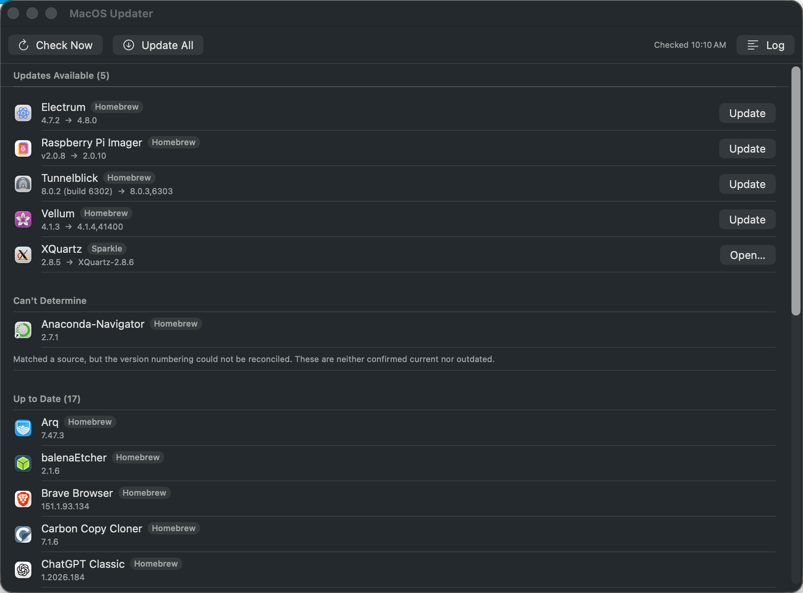

# MacOS Updater

A menu bar app that finds macOS applications needing an update — including
third-party apps installed by direct download — and installs them by delegating to
`brew`, `mas` and `softwareupdate`.

**[⬇ Download MacOS Updater 1.2.4.dmg](https://github.com/wcharliebrown/MacOS-Updater/raw/main/build/MacOS%20Updater%201.2.4.dmg)**
— signed and notarized; open it and drag the app to Applications. Requires macOS 14
or later, plus [Homebrew](https://brew.sh) for most update sources.



The first launch opens this window on its own — a menu bar app has no Dock icon, so
otherwise nothing visible happens when you open it — and says where to find the app
afterwards. Later launches are silent.

The window (menu bar → **Open Window**) lists every app it checked, not just the
outdated ones — each row carries the source it was identified from and the version
actually installed, so a claim of "up to date" can be verified rather than trusted.
Apps needing an update appear at the top with an **Update** button; **Check Now**
rescans, and **Log** shows the exact commands and their output.

In the menu bar itself the app is a single status item, badged with the number of
apps behind:


## Why this is not trivial

macOS has no unified update mechanism. On a typical Mac only a handful of apps come
from Homebrew or the App Store; the rest are direct downloads, and most of those use
proprietary updaters with no queryable feed. Of 41 apps scanned during development,
only 3 exposed a Sparkle `SUFeedURL`.

The workaround is the **Homebrew cask catalog**. It describes upstream versions for
~7,700 apps *regardless of how they were installed*, so it works as a version oracle
keyed by app bundle name. The app reads that catalog from whichever source is available, preferring fidelity
over convenience:

1. `~/Library/Caches/Homebrew/api/cask.jws.json` — Homebrew's cache up to 6.0.15.
2. `formulae.brew.sh/api/cask.json`, cached locally for 6 hours — full data, needs network.
3. `~/Library/Caches/Homebrew/api/internal/packages.<arch>_<codename>.jws.json` —
   Homebrew 6.0.16+ replaced the old cache with this. It is an offline last resort
   because it carries **no per-OS `variations`**, so a handful of casks report a
   version that does not apply to this macOS release. The app says so in Settings when
   it falls back this far.

Reading only source 1 is how this breaks silently: after Homebrew updates itself the
file simply vanishes, the catalog loads zero casks, and every app looks up to date.

## Sources

| Source | Covers | Installs via |
|---|---|---|
| Homebrew cask catalog | Most third-party apps, brew-installed or not | `brew upgrade` / `install --force` / `reinstall` / `--adopt` |
| Mac App Store (`mas`) | Receipted App Store apps | `mas upgrade <id>` |
| Sparkle appcasts | Apps with a feed and no cask | Hand-off to the vendor download |
| `softwareupdate` | macOS and system components | `softwareupdate --install` (in Terminal) |

Precedence: an App Store receipt always wins — adopting such an app into Homebrew
would detach it from App Store updates. The cask catalog covers everything else, and
Sparkle only fills the remaining gaps.

The source badge tells the truth about installation, not just about where version data
came from: **Homebrew** appears only when brew's Caskroom actually has the app (this
exact bundle, in /Applications). An app installed by hand from the vendor's site shows
**Direct download** — its version is still checked against the cask catalog, and
updating it from here brings it under Homebrew's management. The CLI prints these as
`homebrew` and `catalog`.

## Honest reporting

The app distinguishes four states rather than collapsing them into two:

- **Updates Available** — a confirmed comparison.
- **Can't Determine** — matched a source, but the version schemes could not be
  reconciled. Shown explicitly, because a false "up to date" is worse than an
  admission of ignorance.
- **Newer Than Catalog** — installed version is ahead. Informational only; the app
  never offers a downgrade.
- **Not Tracked** — no source knows the app.

### Version reconciliation

Cask versions and `Info.plist` versions rarely agree. Real cases handled:

| App | Cask | `CFBundleShortVersionString` | Rule |
|---|---|---|---|
| Docker | `4.86.0,236216` | `4.86.0` | split on comma |
| Zoom | `7.1.5.84650` | `7.1.5 (84650)` | separators collapse to tokens |
| Tunnelblick | `8.0.3,6303` | `8.0.2 (build 6302)` | compare the numeric prefix |
| ExpressVPN | `14.2.0.13656` | `14.2.0` | upstream build not published by the app |
| XQuartz | `XQuartz-2.8.6` | `2.8.5` | strip the product-name prefix |
| Brave | `1.93.134.0` | `151.1.93.134` | needs an override |

Unreconcilable cases go in `Resources/Overrides.json`, and users can add their own at
`~/Library/Application Support/MacOSUpdater/Overrides.json`.

Two further correctness rules earn their keep:

- **Per-OS variations.** 1,347 casks override `version` per macOS release. `anaconda`
  is `2026.07-1` at top level but `2025.06-1` on macOS 26, so ignoring variations
  invents updates that do not exist.
- **Match provenance.** A cask that merely *mentions* an app in an `uninstall.delete`
  path is weak evidence. Such a match may confirm a version but may never claim one is
  outdated — otherwise `anaconda` reports Anaconda-Navigator 2.7.1 as behind the
  distribution's 2025.06-1.

## Removing apps

Right-click any row — including up-to-date and untracked apps — and choose
**Remove…**. A confirmation states exactly what will happen first:

- Apps Homebrew manages are removed with `brew uninstall --cask`, which also clears
  Homebrew's records of them.
- Everything else is moved to the Trash, so removal is recoverable.
- Root-owned bundles (XQuartz's installer sets that) can't be trashed by a user
  process, so the app asks Finder to do the move — approve the one-time Automation
  prompt, then Finder's administrator prompt.
- Uninstalls needing an administrator password are handed to Terminal, like updates.

Updates distinguish two privilege problems, because they have different fixes:

- **Root-owned bundles** (Tunnelblick sets root ownership on itself as a security
  measure) and casks that install `.pkg` payloads genuinely need an administrator
  password, so those run in Terminal, where `brew` can ask for sudo — a GUI
  subprocess would fail silently.
- **App Management** (TCC) shielding, where macOS blocks one app from modifying
  another app's files even when the Unix permissions allow it (Firefox, installed
  by Mozilla's own updater, is a typical case), is *not* a password problem —
  `sudo` in Terminal fails exactly the same way. For these the app asks macOS for
  App Management access, which shows a one-time consent prompt; approve it and the
  update runs directly, no Terminal and no password, now and in the future. If
  access isn't granted, the app opens System Settings → Privacy & Security →
  **App Management** so you can enable "MacOS Updater" there, and the row explains
  what to do.

An update interrupted by that protection used to leave a backup copy of the app in
Homebrew's staging area that made every later attempt fail immediately; the app now
clears such leftovers automatically before updating.
Either way, the outcome of every attempt now shows directly on the row; hover the
icon for the reason, and the Log has the full output.

Removal only routes through Homebrew when the selected bundle is the one brew
installed. A duplicate copy elsewhere (say, `~/Applications/Vellum.app` next to a
brew-managed `/Applications/Vellum.app`) is always trashed directly — running
`brew uninstall` against it would delete the managed copy instead.

## Unused apps

Rows show "Last opened N months ago" once an app crosses a configurable threshold
(Settings → *Flag apps unused for*, default 90 days), along with a Remove button
directly on the row. The date is Spotlight's `kMDItemLastUsedDate` — the same
"Last Opened" Finder shows.

Two deliberate silences keep this honest: apps with **no usage record** are never
flagged (Spotlight simply has no data for some genuinely-used apps), and **currently
running** apps are never flagged (a menu bar app launched at login months ago can
carry a stale last-used date).

## Requirements

- macOS 14 or later
- [Homebrew](https://brew.sh) for most updates
- `brew install mas` for App Store updates

The app never installs Homebrew for you; it shows a banner if it is missing.

## Icon

`Resources/AppIcon.icns` is generated, not hand-drawn, so it can be regenerated after a
tweak:

```sh
swift Scripts/make-icon.swift          # writes build/AppIcon.iconset
iconutil -c icns build/AppIcon.iconset -o Resources/AppIcon.icns
```

Each of the ten sizes is drawn at its target resolution rather than downscaled from
1024, which is what keeps the 16pt rendering legible. `build-app.sh` picks the `.icns`
up automatically when it is present.

Two constraints are worth preserving if you edit it:

- **Stay on Apple's grid** — an 824x824 body centred in a 1024 canvas, and **no baked
  drop shadow**. macOS 26 measures artwork against that geometry; anything overflowing
  it is treated as a legacy icon and parked on a grey tile instead of being masked to
  the system shape. A baked shadow alone is enough to trigger it. macOS draws the
  shadow itself.
- **Composite the glyph in a transparency layer.** Shadowing each piece separately
  seams the overlaps, and merging them into one path cancels the overlap under the
  nonzero winding rule.

## Building

```sh
./Scripts/build-app.sh --debug --adhoc   # fast local build
./Scripts/build-app.sh                   # universal, Developer ID signed
./Scripts/release.sh                     # signed + notarized .dmg
./Scripts/release.sh --skip-notarize     # .dmg without notarization
```

Notarization needs a one-time keychain profile:

```sh
xcrun notarytool store-credentials AC_NOTARY \
    --apple-id <apple-id> --team-id 54MH33556M --password <app-specific-password>
```

`Scripts/config.sh` pins signing to the login keychain via `SIGN_KEYCHAIN`. This is
deliberate: when the same Developer ID identity exists in more than one keychain, a
locked keychain earlier in the search list makes `codesign` block on a password prompt.

## Engine and CLI

All logic lives in `UpdaterKit`, a plain Swift package with no UI dependencies, so it
can be tested and scripted. `updater-cli` is a thin front-end used to verify the engine
against `brew outdated --cask --greedy`, `mas outdated` and `softwareupdate --list`:

```sh
cd UpdaterKit
swift run updater-cli              # outdated only
swift run updater-cli --detail     # everything, including untracked apps
swift run updater-cli plan         # exact command each update would run
swift run updater-cli --json       # machine-readable
swift run updater-cli --no-network # catalog only, no network calls
swift test
```

`plan` is worth knowing about: it prints the precise command before anything runs, and
the app's Settings has a **Dry run** switch that makes the Update buttons log that
command instead of executing it.

### Choosing the Homebrew command

`--adopt` adopts "existing artifacts **identical to those being installed**", so it is
only correct when the installed version already matches the catalog. Using it on an app
that is *behind* risks Homebrew recording the catalog version against an unchanged
bundle. The planner therefore picks:

| Situation | Command |
|---|---|
| Not brew-managed, already current | `brew install --cask --adopt <token>` |
| Not brew-managed, behind | `brew install --cask --force <token>` |
| Brew-managed, behind | `brew upgrade --cask <token>` |
| Brew-managed, but the Caskroom already records the target version while the bundle is older | `brew reinstall --cask <token>` |

That last row is only detectable because versions are read from `Info.plist` rather
than trusted from Homebrew's own bookkeeping; a plain `upgrade` would report "already
installed" and change nothing.

## Known limitations

- Sparkle updates are handed off to the vendor rather than installed in place; this
  build deliberately does not download and swap app bundles itself.
- Anything needing an administrator password (`pkg` casks, `softwareupdate`) is handed
  to Terminal, because a GUI subprocess cannot answer a `sudo` prompt.
- Any Homebrew route moves an app under Homebrew's management. That is a one-way step,
  and the confirmation text says so.
- `mas outdated` uses its faster, less accurate logic by default and can miss updates.
